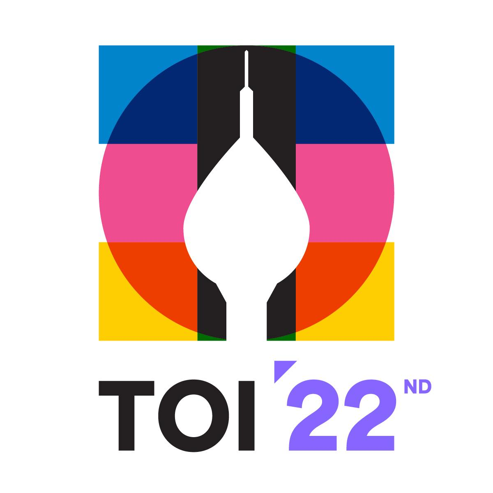

# TOI22 Unofficial Solution

รวม Solution Code + คำอธิบาย (แบบไม่ official)

โจทย์การแข่งขันคอมพิวเตอร์โอลิมปิกระดับชาติครั้งที่ 22 (22nd Thailand Olympiad in Informatics, TOI22)

### Day 1
- [phimai (WIP 🔨)](problem/phimai.md)
- [bakshin (WIP 🔨)](problem/bakshin.md)
- [elephant](problem/elephant.md)

### Day 2
- [cat](problem/cat.md)
- [market (WIP 🔨)](problem/market.md)
- [hornbill (WIP 🔨)](problem/hornbill.md)

## Author

- [Sean Wanitchollakit](https://github.com/NortGlG) (Me)